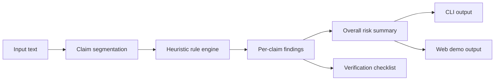

# Architecture

## Overview

ClaimScout is structured as a small monorepo with a reusable analysis engine and thin product surfaces around it.

## Packages

### `packages/core`
The reusable analysis engine.

Responsibilities:

- split input into candidate claims
- apply transparent heuristics
- generate per-claim reasons
- generate report summaries and next steps
- export report as JSON or Markdown

### `packages/cli`
Thin interface over the core package.

Responsibilities:

- parse arguments
- read text from `--text`, `--file`, or stdin
- print human or machine-readable output

### `demo/`
A static local demo for easy sharing.

Responsibilities:

- let users paste text instantly
- visualize severity bands and reasoning
- provide example presets

## Core pipeline

1. **Normalize input**
   - trim whitespace
   - collapse duplicate spacing
2. **Split into claim candidates**
   - sentence-based segmentation with guardrails
3. **Detect cues**
   - numeric claims
   - source markers
   - urgency markers
   - absolutist wording
   - anonymous authority patterns
   - high-impact domains like health and finance
4. **Score each claim**
   - additive risk points
   - subtractive trust cues when attribution exists
5. **Summarize**
   - overall severity
   - top reasons
   - next verification actions
6. **Format**
   - JSON
   - Markdown
   - browser cards

## Why no black-box model in v0.1

For a trust-sensitive domain, black-box scoring creates product and governance problems too early.

v0.1 intentionally favors:

- transparency
- inspectability
- reproducibility
- zero required API keys

## Planned extension points

### Evidence adapters
Future modules can query:

- trusted public health sources
- government datasets
- fact-check archives
- newsroom CMS systems

### LLM explanation layer
Optional, never mandatory.

Rules:

- only summarize grounded evidence
- keep the rule-based score as the source of truth
- never output unsupported truth claims

### MCP / assistant integration
ClaimScout is well-suited to become a tool callable by AI assistants, enabling “analyze before answer” workflows.

## Risk and ethics guardrails

- no identity-based scoring
- no hidden reputation scoring of people
- no “truth” label without evidence
- no surveillance assumptions
- encourage verification over certainty
